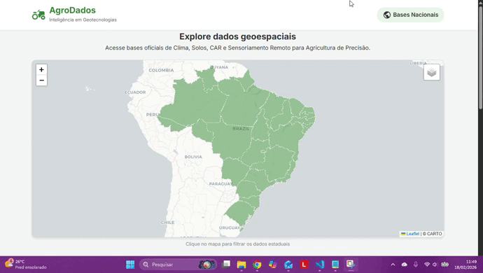

# AgroDados: Hub de Inteligência Geoespacial para Agricultura de Precisão


Este projeto consiste em uma plataforma WebGIS (Sistema de Informação Geográfica na Web) desenvolvida para centralizar, organizar e facilitar o acesso a dados geoespaciais estratégicos do território brasileiro. A aplicação foca no tripé: Agricultura de Precisão, Monitoramento Ambiental e Regularização Fundiária.

Acesso em: [https://pedroluizskt.github.io/agrodados-webgis/]

---

## 1. Visão Geral e Contexto Estratégico

A fragmentação de dados geoespaciais no Brasil é um desafio para engenheiros agrônomos, gestores ambientais e produtores rurais. Informações cruciais estão dispersas entre múltiplos órgãos (INPE, IBGE, Embrapa, ANA, SGB), muitas vezes em interfaces complexas e não adaptadas para dispositivos móveis.

O **AgroDados** soluciona este problema através de uma arquitetura leve e responsiva. O sistema integra visualização cartográfica interativa com um catálogo curado de bases de dados oficiais, permitindo que o profissional em campo acesse:
* **Clima e Recursos Hídricos:** Dados de precipitação, outorgas e bacias hidrográficas.
* **Fundiário:** Limites de propriedades (SIGEF/INCRA) e Cadastro Ambiental Rural (CAR).
* **Sensoriamento Remoto:** Imagens de satélite e índices de vegetação.

---

## 2. Demonstração da Aplicação

A interface foi projetada seguindo o paradigma *Mobile-First*, garantindo usabilidade tanto em estações de trabalho (Desktop) quanto em tablets e smartphones utilizados em campo.

<p align="center">
  
  <br>
  <em>*Interatividade do mapa, alternância de camadas (WMS/Satélite) e filtragem dinâmica de dados por Unidade Federativa.*</em>
</p>

---

## 3. Arquitetura da Solução WebGIS

O projeto adota uma arquitetura *Client-Side* pura, eliminando a necessidade de backends complexos para esta fase, garantindo alta performance e facilidade de hospedagem.

1.  **Core Cartográfico (Leaflet.js):** Utilização da biblioteca Leaflet para renderização de mapas, escolhida por sua leveza e suporte robusto a dispositivos móveis.
2.  **Interoperabilidade OGC (WMS):**
    * Consumo de serviços **WMS (Web Map Service)** para renderização de relevo e topografia (Fonte: Mundialis).
    * Integração de *Tiles* de imagens de satélite (Fonte: ESRI World Imagery) para análise visual da cobertura do solo.
3.  **Estrutura de Dados (JSON Database):**
    * Os metadados dos recursos geoespaciais são armazenados em uma estrutura de objetos JavaScript (`data.js`), permitindo filtragem instantânea no navegador sem latência de banco de dados.
    * Utilização de **GeoJSON** para renderização vetorial dos limites estaduais brasileiros, com simplificação geométrica para otimização de banda.
4.  **Design Responsivo:**
    * **Desktop:** Visualização de mapa interativo com *mouse-events* (hover, click).
    * **Mobile:** Adaptação automática da interface, substituindo o mapa por seletores nativos (Dropdowns) para facilitar a navegação tátil.

---

## 4. Funcionalidades Técnicas

* **Controle de Camadas (Layer Control):** Permite ao usuário alternar entre mapas base vetoriais (Clean), imagens de satélite (ESRI) e modelos digitais de elevação (Topografia WMS).
* **Filtragem Espacial:** Lógica de *binding* entre a geometria do estado selecionado e o catálogo de dados. Ao selecionar "Mato Grosso", o sistema filtra apenas as bases de dados pertinentes àquela jurisdição.
* **Travamento de Extensão (MaxBounds):** Configuração de limites geográficos que impedem o usuário de navegar para fora da área de interesse (América do Sul/Brasil).
* **UX/UI Otimizada:** Feedback visual imediato ao passar o mouse sobre as feições geográficas e *cards* de informação com links diretos e categorização por tags (ex: #Solo, #Clima).

---

## 5. Próximos Passos (Roadmap)

A evolução do projeto prevê a implementação de recursos avançados de geoprocessamento:

* **Integração com API do IBGE:** Automatizar a consulta de metadados municipais via API de Dados Agregados.
* **Visualização de GeoJSON do Usuário:** Permitir que o agrônomo arraste um arquivo `.geojson` ou `.kml` (talhão) para visualizar sobre o mapa base.
* **PWA (Progressive Web App):** Transformar a aplicação em instalável para permitir consultas offline de dados previamente cacheados.

---

## 6. Stack Tecnológico

* **Linguagem:** HTML5, CSS3, JavaScript (ES6+)
* **Biblioteca de Mapas:** Leaflet.js v1.9.4
* **Protocolos de Dados:** GeoJSON, WMS (Web Map Service), XYZ Tiles
* **Fontes e Ícones:** Google Fonts (Inter), Material Icons
* **Hospedagem:** GitHub Pages

---

## 7. Como Executar o Projeto Localmente

Devido às políticas de segurança dos navegadores (CORS) para carregamento de arquivos GeoJSON locais, recomenda-se o uso de um servidor local simples.

```bash
# 1. Clone o repositório
git clone [https://github.com/SEU-USUARIO/agrodados-webgis.git](https://github.com/SEU-USUARIO/agrodados-webgis.git)
cd agrodados-webgis

# 2. Se você tiver Python instalado (método mais simples):
# Isso iniciará um servidor na porta 8000
python -m http.server

# 3. Acesse no navegador:
# http://localhost:8000
```
---

## 8. Referências Técnicas
As fontes de dados e documentações utilizadas para a construção deste hub incluem:

Leaflet Documentation: https://leafletjs.com/

Mundialis OGC WMS: https://www.google.com/search?q=https://www.mundialis.de/en/ows-mundialis/

Code for America (GeoJSON Source): Repositório de dados públicos vetoriais.

INDE (Infraestrutura Nacional de Dados Espaciais): Padrões de metadados brasileiros.

---

Autor

Desenvolvido por Pedro Luiz

Engenheiro Florestal e Cientista de Dados Geoespaciais

Linkedin: [www.linkedin.com/in/pedro-luiz-rodrigues-vaz-de-melo]

Especialista na interseção entre Geotecnologias, Inteligência de Dados, Agronegócio e formulação de Políticas Públicas. Focado em soluções de alta performance para monitoramento territorial.
